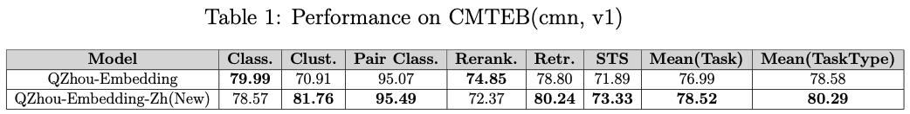
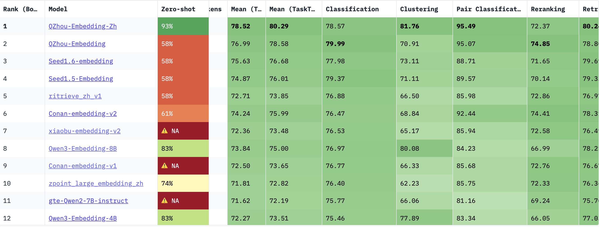
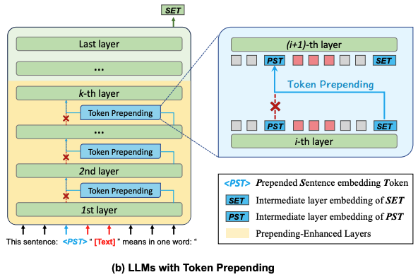
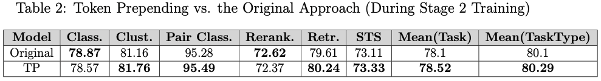
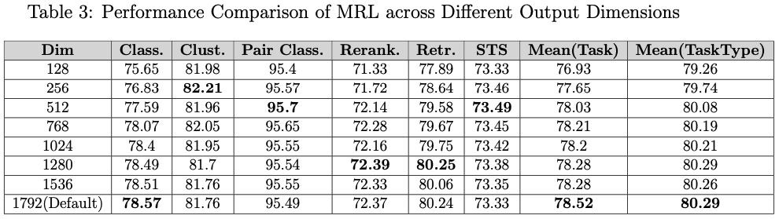

# QZhou-Embedding-Zh

## Introduction
We are pleased to announce the release of our new model, <a href="https://huggingface.co/Kingsoft-LLM/QZhou-Embedding-Zh">​QZhou-Embedding-Zh</a>​​​, which excels in a variety of Chinese-language tasks including retrieval, ranking, semantic similarity, and semantic understanding. Built upon the architecture and parameters of the ​​Qwen3-8B​​ base model, QZhou-Embedding-Zh was developed using the data construction and training methodology of ​​QZhou-Embedding, and also incorporated MRL embedding inference​​. Leveraging the powerful Chinese language capabilities of Qwen3-8B, QZhou-Embedding-Zh achieves significant improvements across multiple tasks on the CMTEB benchmark—including retrieval, STS, clustering, Pair Classification, and reranking, with notable gains in both overall and task-type average scores.

## Key Enhancements and Optimizations​

To build a more powerful and outstanding model, we have adopted proven approaches from QZhou-Embedding and further introduced the following optimizations:

1. **​​Based on Qwen3 Model​​:** In our practice with QZhou-Embedding, the Qwen3 base model did not show significant advantages over Qwen2.5-7B-Instruct in the first stage (Retrieval). However, notable improvements were observed in Chinese-language tasks, likely due to Qwen3’s stronger Chinese capabilities. We upgraded the base model to Qwen3-8B while retaining the original model architecture, using a ​​last_token pooling​​ strategy.

2. **​​Support for MRL​​:** MRL (Multi-Representation Learning) is highly demanded in practical applications, especially under high-concurrency and low-latency scenarios. Addressing the lack of MRL support in QZhou-Embedding, QZhou-Embedding-Zh now incorporates this feature with the following dimension options: "128, 256, 512, 768, 1024, 1280, 1536, 1792". The default output dimension is set to ​​1792​​.

3. **​Token Prepending​​:** Originally proposed by Fu et al(ACL 2025, Volume 1: Long Papers, 3168–3181), this technique addresses the limitations of the unidirectional attention mechanism in decoder-only models. By prepending each layer’s decoded sentence embedding to the beginning of the sentence in the next layer’s input, allowing earlier tokens to attend to the complete sentence information under the causal attention mechanism, ​Token Prepending​ significantly improving performance in STS tasks and classification tasks. We retained the Stage-1 training strategy unchanged and integrated ​​Token Prepending during Stage-2 training​​, using the PromptEOL template construction method described in their paper. Experimental results demonstrate that Token Prepending is not only a training-free enhancement but also further improves performance when fine-tuned with supervised datasets.

## CMTEB Results

<div align="center">
</img>
</div>

These are the ranking results on the CMTEB leaderboard (as of October 1st)：
<div align="center">
</img>
</div>

## ​Token Prepending
### Introduction
​Token Prepending is a simple yet effective technique proposed by Fu et al., the core idea is prepending each layer’s decoded sentence embedding to the beginning of the sentence in the next layer’s input, allowing earlier tokens to attend to the complete sentence information under the causal attention mechanism. TP technique is a plug-and-play technique neither introduces new parameters nor alters the existing ones, allowing it to be seamlessly integrated with various prompt-based sentence embedding methods and autoregressive LLMs. The architecture described in the original paper is as follows:
<div align="center">
</img>
</div>

### Our Adaptations and Optimizations​
According to the conclusions presented in the original paper, TP technique is completely training-free and requires no extra learnable parameters, serving as a plug-and-play technique to improve the various prompt-based methods. Since QZhou-Embedding-Zh is built upon the Qwen3 base model—retaining its unidirectional attention mechanism and employing last_token pooling—it is ideally suited for the application of the TP technique. To further explore its potential, we conducted training utilizing the TP technique, building upon the Stage 1 retrieval base model through the following procedure:
1. We modified the model forward script by applying the TP specifically from layer-1 to layer-7(index), namely prepending the last embeddings to the input before processing through these layers；
2. For the input template design, we have integrated the PromptEOL template on top of the instruction-based input, using <|im_start|>as a placeholder—corresponding to the \<PST\> token in the original paper—to facilitate subsequent TP operations. The full template structure is designed as follows:
```
"This sentence: <|im_start|>“Instruct: [instruction]\nQuery: [user_input]” means in one word: “
```
3. Stage 2 training was conducted using the updated model architecture and input structure.

### Results
We maintained the Stage 1 training strategy unchanged, keeping all data, processing logic, and MRL configurations consistent across stages. The only modification was applied during Stage 2, where we compared the original instruction-based embedding training(used in QZhou-Embedding) against the Token Prepend-based training approach. The performance comparison on the CMTEB benchmark is shown below:
<div align="center">
</img>
</div>
The results clearly show that even when applying TP starting from Stage 2, it still leads to measurable performance improvements — demonstrating the effectiveness and broad applicability of this technique.

## MRL Performance Comparison
We have evaluated the CMTEB performance across all MRL output dimensions, with detailed results as follows:
<div align="center">
</img>
</div>

As the comparison results clearly demonstrate, using lower-dimensional outputs can impact overall performance to some extent. For instance, the 128-dimensional output shows an average score decrease of approximately 1% compared to the default configuration, and a similar gap is observed with 256 dimensions. However, once the dimensionality exceeds **512**, no significant performance degradation is observed. In fact, certain subtasks even achieve state-of-the-art (SOTA) results under specific dimensional settings—such as **STS tasks at 512 dimensions**, and **Retrieval and Rerank tasks at 1280 dimensions**.

In terms of the overall average score, **using the full-dimensional embedding yields slightly higher results**. That said, for high-throughput scenarios where moderate performance trade-offs are acceptable, the lower dimension like **512** remains a strong and efficient alternative.

## Usage
To facilitate model inference and CMTEB result replication on your own machine, we provide detailed specifications for environmental dependencies and model implementation. 

### Requirements
- Python: 3.10.12
- Sentence Transformers: 3.4.1
- Transformers: 4.51.1
- PyTorch: 2.4.1
- Accelerate: 1.3.0
- Datasets: 3.6.0
- Tokenizers: 0.21.1
- mteb: 1.38.30

### Quickstart
Since QZhou-Embedding-Zh incorporates a dedicated MRL linear projection module built on the sentence-transformers framework, we now only provide inference code specifically designed for sentence-transformers compatibility.

```
from sentence_transformers import SentenceTransformer
from sklearn.preprocessing import normalize

def get_prompteol_input(text: str) -> str:
    return f"This sentence: <|im_start|>“{text}” means in one word: “"

def get_detailed_instruct(task_description: str, query: str) -> str:
    return f'Instruct: {task_description}\nQuery:{query}'

model = SentenceTransformer(
    "Kingsoft-LLM/QZhou-Embedding-Zh",
    model_kwargs={"device_map": "cuda", "trust_remote_code": True},
    tokenizer_kwargs={"padding_side": "left", "trust_remote_code": True},
    trust_remote_code=True
)

task= "Given a web search query, retrieve relevant passages that answer the query"
queries = [
    get_prompteol_input(get_detailed_instruct(task, "光合作用是什么？")),
    get_prompteol_input(get_detailed_instruct(task, "电话是谁发明的？"))
]

documents = [
    get_prompteol_input("光合作用是绿色植物利用阳光、二氧化碳和水生成葡萄糖和氧气的过程。这一生化反应发生在叶绿体中。"),
    get_prompteol_input("亚历山大·格拉汉姆·贝尔（Alexander Graham Bell）因于1876年发明了第一台实用电话而广受认可，并为此设备获得了美国专利第174,465号。")
]

query_embeddings = model.encode(queries, normalize_embeddings=False)
document_embeddings = model.encode(documents, normalize_embeddings=False)

dim=1792 # 128, 256, 512, 768, 1024, 1280, 1536, 1792
query_embeddings = normalize(query_embeddings[:, :dim])
document_embeddings = normalize(document_embeddings[:, :dim])

similarity = model.similarity(query_embeddings, document_embeddings)
print(similarity)
```

### Completely replicate the benchmark results
Find our benchmark evaluation code on <a href="https://github.com/Kingsoft-LLM/QZhou-Embedding-Zh">GitHub</a>. 

```
normalize=true
use_instruction=true
export TOKENIZERS_PARALLELISM=true
embed_dim=1792 # 128, 256, 512, 768, 1024, 1280, 1536, 1792

model_name_or_path=<model dir>

python3 ./run_cmteb_all.py \
    --model_name_or_path ${model_name_or_path}  \
    --normalize ${normalize} \
    --dim ${embed_dim} \
    --use_instruction ${use_instruction} \
    --output_dir <output dir>

```


## Citation
If you find our work worth citing, please use the following citation:<br>
**Technical Report:**
```
@misc{yu2025qzhouembeddingtechnicalreport,
      title={QZhou-Embedding Technical Report}, 
      author={Peng Yu and En Xu and Bin Chen and Haibiao Chen and Yinfei Xu},
      year={2025},
      eprint={2508.21632},
      archivePrefix={arXiv},
      primaryClass={cs.CL},
      url={https://arxiv.org/abs/2508.21632}, 
}
```
**Token Prepending: A Training-Free Approach for Eliciting Better Sentence Embeddings from LLMs:**
```
@inproceedings{fu-etal-2025-token,
    title = "Token Prepending: A Training-Free Approach for Eliciting Better Sentence Embeddings from {LLM}s",
    author = "Fu, Yuchen  and
      Cheng, Zifeng  and
      Jiang, Zhiwei  and
      Wang, Zhonghui  and
      Yin, Yafeng  and
      Li, Zhengliang  and
      Gu, Qing",
    booktitle = "Proceedings of the 63rd Annual Meeting of the Association for Computational Linguistics (Volume 1: Long Papers)",
    month = jul,
    year = "2025",
    publisher = "Association for Computational Linguistics",
    url = "https://aclanthology.org/2025.acl-long.159/",
}
```

**Qwen3 Series:**
```
@misc{qwen3technicalreport,
      title={Qwen3 Technical Report}, 
      author={Qwen Team},
      year={2025},
      eprint={2505.09388},
      archivePrefix={arXiv},
      primaryClass={cs.CL},
      url={https://arxiv.org/abs/2505.09388}, 
}
```
